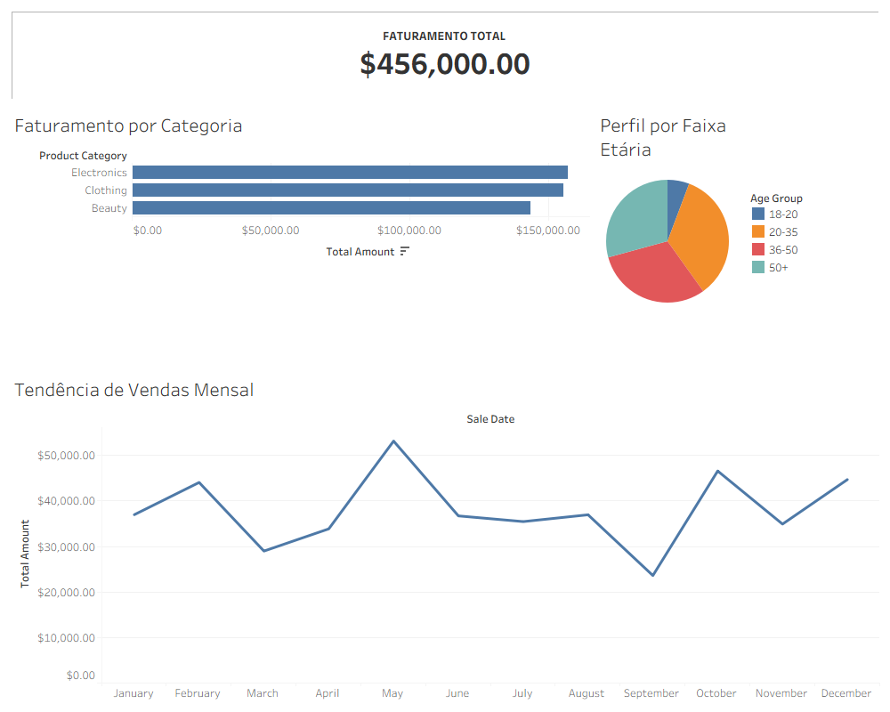

# 📊 Retail Sales Analysis: SQL + Tableau Performance Dashboard

Este repositório apresenta um projeto de **Business Intelligence** ponta a ponta. A partir de um dataset bruto de varejo, realizei a modelagem de dados via SQL para construção de uma camada analítica, culminando em um dashboard executivo no Tableau para suporte à tomada de decisão.

## 🚀 Estrutura do Projeto

A arquitetura foi desenhada para garantir reprodutibilidade e escalabilidade:

* **/sql_scripts**: Pipeline de dados contendo o DDL para criação do schema (`01_schema.sql`), criação de Views para limpeza (`02_view_tableau.sql`) e consultas de inteligência de negócio (`03_business_queries.sql`).
* **/tableau**: Arquivo contendo a visualização interativa (`.twbx`).
* **/docs**: Documentação visual e prints profissionais do projeto.
* **/outputs**: Resultados das análises exportados em CSV.

## 📂 Fonte dos Dados
Os dados foram obtidos através do **Kaggle** (Retail Sales Dataset).

## 🛠️ Tecnologias e Metodologias

* **Banco de Dados:** PostgreSQL (Modelagem, Views e CTEs).
* **Visualização:** Tableau Desktop Professional (Design de Dashboards e Storytelling).
* **Versionamento:** Git & GitHub (Fluxo de trabalho seguindo boas práticas).

## 📈 Dashboard e Insights de Negócio

O faturamento total analisado foi de **$456,000.00**, apresentando os seguintes comportamentos críticos:

1.  **Sazonalidade:** Identificou-se um pico de vendas expressivo no mês de **Maio**, seguido por uma recuperação consistente no encerramento do ano.
2.  **Mix de Categorias:** A categoria de **Electronics** lidera o faturamento, seguida de perto por Clothing e Beauty, indicando um portfólio de produtos equilibrado.
3.  **Perfil Demográfico:** O público na faixa de **20-35 anos** representa a maior parcela do faturamento, sugerindo que estratégias de marketing digital devem ser priorizadas para este segmento.

## 🏁 Como Utilizar este Repositório

1.  Clone o projeto: `git clone https://github.com/Mpierredev/analise-vendas-sql.git`
2.  Execute os scripts na pasta `/sql_scripts` na ordem numérica para recriar o banco de dados.
3.  Abra o arquivo `./tableau/Retail_Sales_Performance_Analysis_v1.twbx` no Tableau Desktop para explorar a visualização de forma interativa.

---
*Projeto desenvolvido para fins de portfólio em Análise de Dados.*